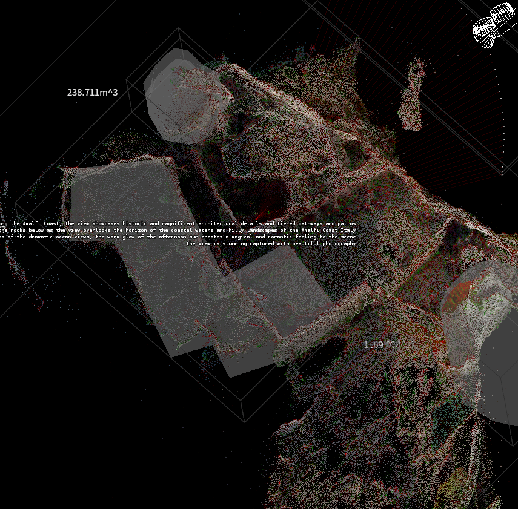
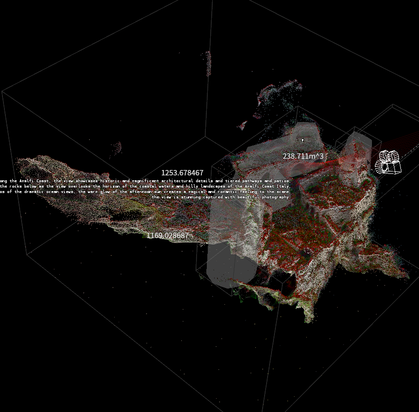
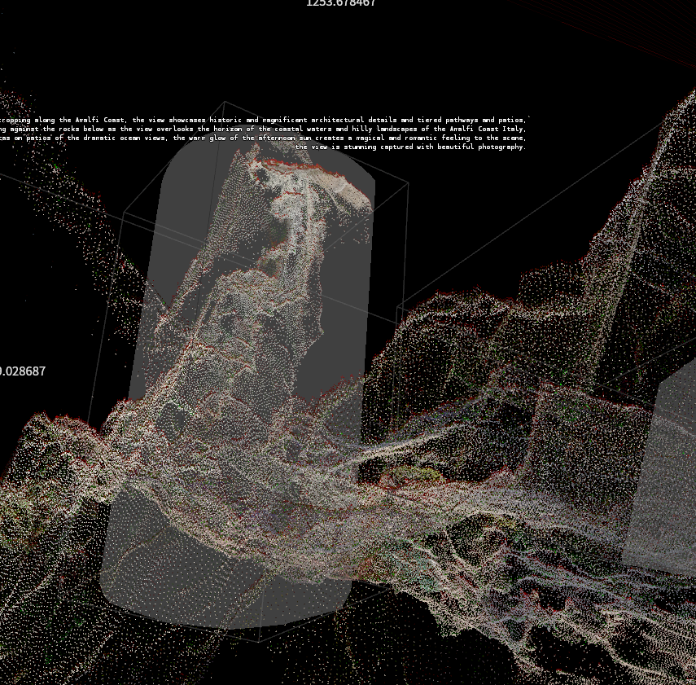
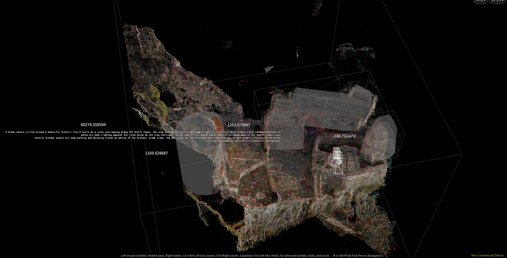
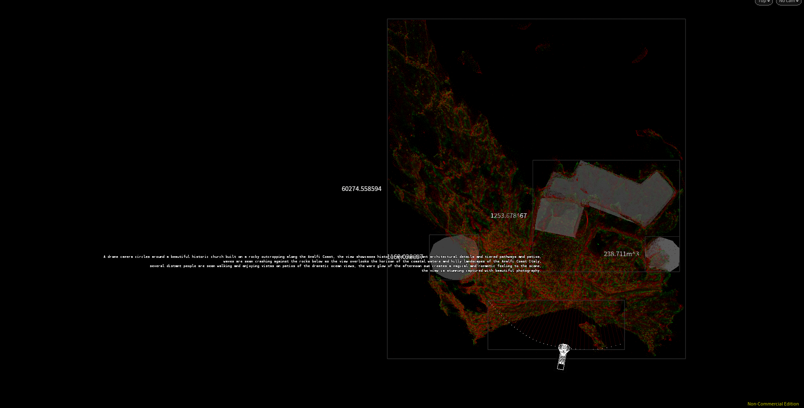
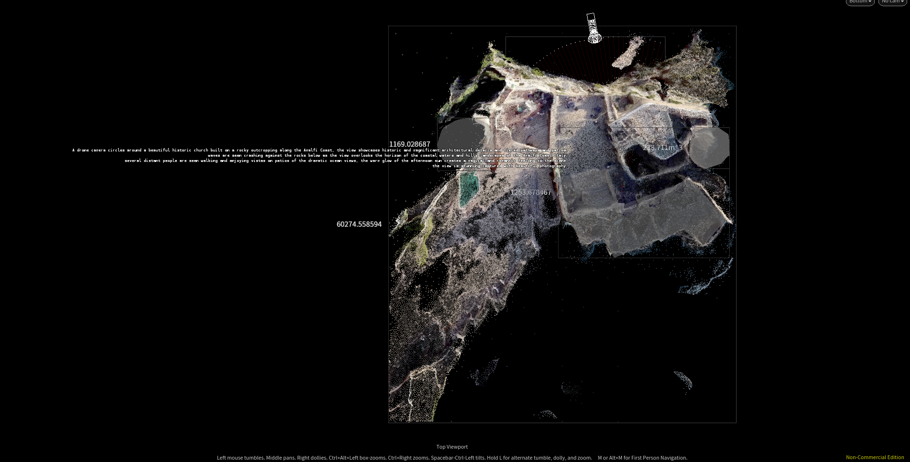
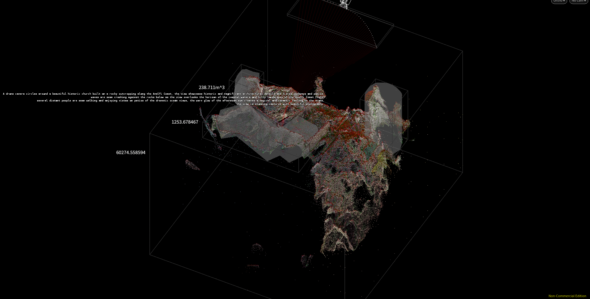
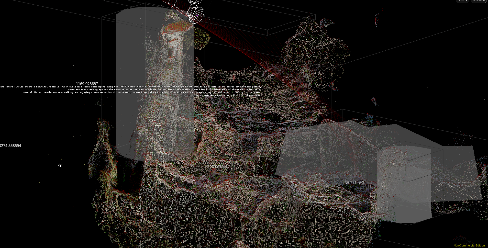
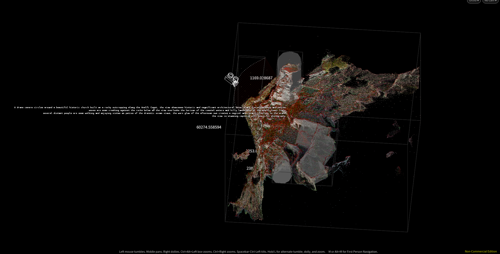

## Ai model extraction instructions 

### Phase 1: Download and Extract Frames from YouTube

1. **Set up Python Environment:**
    - Create a Python virtual environment:
      ```bash
      python -m venv env
      ```
    - Activate the environment.
    - Install required packages:
      ```bash
      pip install pytube
      pip install opencv-python
      ```

2. **Write Script:**

    Create a Python script (e.g., `extract_and_download.py`) with the following content:

    ```python
    from pathlib import Path
    from pytube import YouTube
    import cv2 
    import os

    # Create directory for storing images
    imagepath = Path("./images") 
    imagepath.mkdir(exist_ok=True)

    # Download YouTube video
    url ="https://www.youtube.com/watch?v=HK6y8DAPN_0"
    yt = YouTube(url)
    video = yt.streams.get_by_itag(137)
    video.download()

    # Extract frames from video
    frame_no = 0 
    cap = cv2.VideoCapture("Introducing Sora — OpenAI’s text-to-video model.mp4")
    while (cap.isOpened()):
        ret, frame = cap.read()
        if(frame_no % 10 == 0): 
            name =  f"frame_{frame_no}.jpg"
            target = os.path.join(imagepath,name)
            cv2.imwrite(target, frame)
        frame_no +=1  
    ```

3. **Execute Script:**
   
   Run the script:
   ```bash
   python extract_and_download.py
   ```

### Phase 2: Create 3D Model from Footage

0. **Install RealityCapture Software:**
   
   Download and install RealityCapture software for non-commercial use from [here](https://we.tl/t-SJ8bFe1gEa).

1. **Input Images:**
   
   Use the extracted frames as input images.

2. **Align Images:**
   
   Align the input images within RealityCapture.

3. **Reconstruct in Normal Detail:**
   
   Reconstruct the scene in normal detail using RealityCapture.

4. **Generate a Texture Map:**
   
   Generate a texture map for the reconstructed model.

5. **Export with Camera as Part of the Model:**
   
   Export the model along with the camera information as part of the model.

### Phase 3: Reconstruct Camera Path in Houdini

1. **Extract Model and Camera:**
   
   Import the reconstructed model and camera data into Houdini.

2. **Generate Direction Vector:**
   
   Generate direction vectors for the camera path reconstruction.

3. **Fix Point Sorting:**
   
   Ensure proper sorting of points for accurate reconstruction.

4. **Apply Camera to New Path:**
   
   Apply the camera data to reconstruct the camera path.

5. **Add Geometry to Scene:**
   
   Integrate the reconstructed model and camera path into the Houdini scene.

6. **Render Scene:**
   
   Render the final scene with the reconstructed camera path and geometry.

### Example Images:

1. 
2. 
3. 
4. 
5. 
6. 
7. 
8. 
9. 
